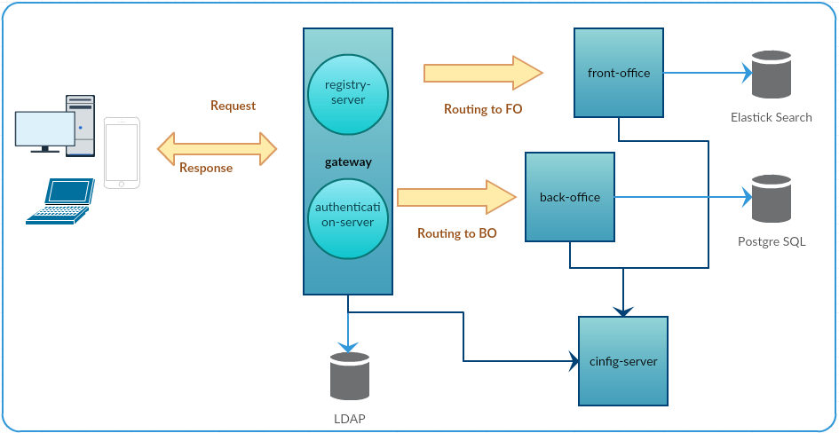

# app: spring-boot application
Personal apllication to apply latest expertise working with different spring projects and develop a microservices application based on spring cloud, external configuration, security layer, and routing layer  

# project description:
* app-root : centralize dependency management and mudules + apply clean install goal 
* config-module : centralize config on the git hub repo using spring cloud config server
* discovery-module : bootsrap config by spring cloud starter config + using spring cloud config eureka server + register APIs + redirect clients to the right API using Zuul proxy => microservices.
* front-office : API client side + ping to discovery server + provide services + integration with other APIs by spring cloud feign
* back-office : API admin side + ping to discovery server + provide services + integration with other APIs by spring cloud feign
* spring-security : centralized authenticatio (basic auth) + centralized request autorization (CORS config,JWT method)

# project architecture:

